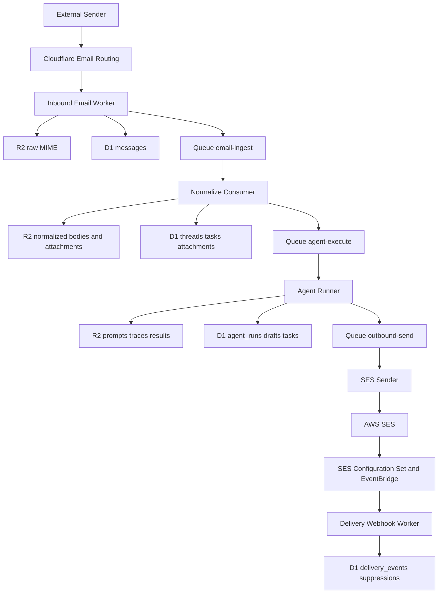

# AI Agent Email Runtime MVP Spec

## Overview

This project is an email-first infrastructure layer for AI agents.

It is not a human inbox, IMAP server, or general-purpose agent operating system.
The MVP focuses on one opinionated runtime:

- register agents
- bind agents to mailboxes
- ingest inbound email
- normalize email into structured state
- create agent tasks
- let agents draft replies
- send outbound mail through Amazon SES
- track delivery, bounce, and complaint events
- preserve replayability and auditability

## Goals

- Fully serverless runtime
- Low-cost architecture
- Multi-tenant friendly
- Auditable and replayable email processing
- Clear control plane and data plane boundaries

## Non-Goals

- Human inbox UI
- IMAP / POP3 / SMTP server compatibility
- Cross-channel orchestration
- Long-term vector memory
- Complex approval workflows
- Enterprise policy engine beyond MVP constraints

## Core Architecture



## Platform Components

### Cloudflare Email Worker

Purpose:

- receive inbound email events
- perform minimal synchronous work
- persist raw MIME before any agent logic

Responsibilities:

- resolve tenant and mailbox
- generate `message_id`
- store raw email in R2
- insert initial `messages` row
- enqueue `email-ingest`

Rules:

- no heavy parsing
- no LLM calls
- no outbound send

### Normalize Consumer

Purpose:

- convert email into structured agent-ready records

Responsibilities:

- parse MIME
- extract text and HTML
- index attachments
- compute normalized thread key
- upsert `threads`
- create `tasks`
- enqueue `agent-execute` if policy allows automatic execution

### Agent API Worker

Purpose:

- expose control plane and agent-facing data plane APIs

Responsibilities:

- agent registration
- mailbox binding
- policy management
- task and message read APIs
- draft creation APIs
- replay APIs

### Agent Runner Consumer

Purpose:

- execute agent work asynchronously

Responsibilities:

- read task context
- load message and thread content
- invoke model/tool stack
- persist run traces
- produce structured task result
- create draft when reply is appropriate

### SES Sender Consumer

Purpose:

- send approved outbound emails through SES

Responsibilities:

- load draft from R2
- apply suppression and policy checks
- send via SES API v2
- record `provider_message_id`
- update `messages`, `drafts`, and `outbound_jobs`

### Delivery Webhook Worker

Purpose:

- receive SES delivery lifecycle events from EventBridge

Responsibilities:

- verify inbound webhook authenticity
- persist raw event to R2
- insert `delivery_events`
- update message and job status
- populate suppression list for bounces and complaints

## Control Plane

The control plane defines who an agent is and what it may do.

Primary resources:

- `Agent`
- `AgentVersion`
- `AgentCapability`
- `AgentToolBinding`
- `AgentDeployment`
- `Mailbox`
- `AgentMailboxBinding`
- `AgentPolicy`

### Agent

Represents the stable identity of an AI worker family.

Fields:

- `id`
- `tenant_id`
- `slug`
- `name`
- `description`
- `status`
- `mode`
- `config_r2_key`
- `default_version_id`

`mode` values:

- `assistant`
- `autonomous`
- `review_only`

`status` values should evolve to:

- `draft`
- `active`
- `disabled`
- `archived`

### AgentVersion

Represents an immutable version of agent configuration.

Fields:

- `id`
- `agent_id`
- `version`
- `model`
- `config_r2_key`
- `manifest_r2_key`
- `status`
- `created_at`

This is the missing layer between an agent identity and runtime execution.

### AgentCapability

Declares what an agent version can do.

Fields:

- `id`
- `agent_version_id`
- `capability`
- `config_json`

### AgentToolBinding

Declares which tools are available to one agent version.

Fields:

- `id`
- `agent_version_id`
- `tool_name`
- `enabled`
- `config_json`

### AgentDeployment

Pins a concrete agent version to a runtime target.

Fields:

- `id`
- `tenant_id`
- `agent_id`
- `agent_version_id`
- `target_type`
- `target_id`
- `status`

This is what lets mailbox routing resolve to a specific version instead of only `agent_id`.

### Mailbox

Represents a routable inbound address or alias.

Fields:

- `id`
- `tenant_id`
- `address`
- `status`

### AgentMailboxBinding

Connects agents to mailboxes.

Fields:

- `agent_id`
- `mailbox_id`
- `role`
- `status`

`role` values:

- `primary`
- `shared`
- `send_only`
- `receive_only`

### AgentPolicy

Restricts and guides agent behavior.

Fields:

- `auto_reply_enabled`
- `human_review_required`
- `confidence_threshold`
- `max_auto_replies_per_thread`
- `allowed_recipient_domains_json`
- `blocked_sender_domains_json`
- `allowed_tools_json`

## Agent Registry Upgrade

The MVP runtime already has an agent table, but the long-term control plane should use
versioned registry records.

Recommended control plane API additions:

- `GET /v1/agents`
- `POST /v1/agents/{agentId}/versions`
- `GET /v1/agents/{agentId}/versions`
- `GET /v1/agents/{agentId}/versions/{versionId}`
- `POST /v1/agents/{agentId}/deployments`
- `GET /v1/agents/{agentId}/deployments`

Recommended runtime resolution:

1. resolve mailbox
2. find active `agent_deployments` record
3. load pinned `agent_version`
4. load `agent_capabilities` and `agent_tool_bindings`
5. execute the run using that exact version

This change is what turns the current agent record model into infrastructure-grade registry behavior.

## Data Plane

The data plane handles the actual message lifecycle.

Primary resources:

- `Thread`
- `Message`
- `Attachment`
- `Task`
- `AgentRun`
- `Draft`
- `OutboundJob`
- `DeliveryEvent`

## Message Lifecycle

1. Sender emails `agent@inbound.example.com`.
2. Cloudflare Email Worker stores raw MIME in R2.
3. Initial message metadata is written to D1.
4. `email-ingest` receives a compact job payload.
5. Normalize Consumer extracts message structure and attachments.
6. A thread is found or created.
7. A task is created and assigned to an agent based on mailbox binding.
8. `agent-execute` runs the assigned agent.
9. The agent returns one of:
   - ignore
   - structured_result
   - needs_review
   - reply_draft
10. If a reply draft is created and policy allows sending, `outbound-send` is enqueued.
11. SES Sender transmits the message through SES.
12. EventBridge sends delivery lifecycle events back to the webhook worker.

## Queue Design

Queue payloads must remain small.
Large payloads are stored in R2 and referenced by key.

### `email-ingest`

```json
{
  "messageId": "msg_123",
  "tenantId": "t_1",
  "rawR2Key": "raw/2026/03/msg_123.eml"
}
```

### `agent-execute`

```json
{
  "taskId": "tsk_123",
  "agentId": "agt_123"
}
```

### `outbound-send`

```json
{
  "outboundJobId": "obj_123"
}
```

### `dead-letter`

```json
{
  "source": "ses-sender",
  "refId": "obj_123",
  "reason": "MessageRejected"
}
```

## Storage Design

### D1

Use D1 for metadata, indexes, ownership, and state transitions.

Never store:

- raw MIME
- full HTML body
- large plain-text bodies
- attachment binary content
- model traces

### R2

Use R2 for large or replay-critical objects.

Key layout:

- `raw/YYYY/MM/{message_id}.eml`
- `normalized/{message_id}.json`
- `bodies/{message_id}/text.txt`
- `bodies/{message_id}/html.html`
- `attachments/{message_id}/{attachment_id}`
- `agent-config/{agent_id}.json`
- `drafts/{draft_id}.json`
- `prompts/{run_id}.json`
- `traces/{run_id}.json`
- `events/ses/{event_id}.json`

## State Machines

### Message Status

- `received`
- `normalized`
- `tasked`
- `replied`
- `ignored`
- `failed`

### Task Status

- `queued`
- `running`
- `done`
- `needs_review`
- `failed`

### Draft Status

- `draft`
- `approved`
- `queued`
- `sent`
- `cancelled`
- `failed`

### Outbound Job Status

- `queued`
- `sending`
- `sent`
- `retry`
- `failed`

## Agent Runner Contract

The runtime should treat the agent as a worker that consumes tasks and emits bounded outputs.

Allowed outputs:

- `ignore`
- `needs_review`
- `structured_result`
- `reply_draft`

The agent must not directly:

- call SES
- mutate message ownership across tenants
- access raw R2 objects outside runtime APIs

## Draft Model

Drafts are stored as JSON in R2.

Example:

```json
{
  "from": "agent@mail.example.com",
  "to": ["user@example.com"],
  "cc": [],
  "bcc": [],
  "subject": "Re: Need help",
  "text": "Thanks for reaching out.",
  "html": "<p>Thanks for reaching out.</p>",
  "inReplyTo": "<original@example.com>",
  "references": ["<original@example.com>"],
  "attachments": []
}
```

## SES Integration

SES is the only outbound provider in the MVP.

Rules:

- use SES API v2
- prefer `Raw` emails for replies with attachments or custom reply headers
- attach a configuration set on every outbound send
- attach tags for `tenant_id`, `message_id`, `draft_id`, and `thread_id`
- use EventBridge to route lifecycle events back to Cloudflare

Recommended tags:

- `tenant_id`
- `mailbox_id`
- `message_id`
- `draft_id`
- `thread_id`
- `agent_id`

## Security Model

Each agent token must be bound to:

- `tenant_id`
- `agent_id`
- allowed scopes
- optionally allowed `mailbox_ids`

Minimum scopes:

- `mail:read`
- `task:read`
- `task:update`
- `draft:create`
- `draft:send`

Runtime enforcement:

- suppression check before send
- per-thread auto-reply cap
- allowed recipient domain enforcement
- blocked sender domain enforcement
- idempotency key for replay and outbound send

## Replay Model

Replay is a first-class feature.

Supported replay types:

- re-normalize a stored raw email
- rerun agent execution against a message

Replay must not:

- silently create duplicate outbound mail
- overwrite original raw artifacts

Replay should:

- create a new `agent_run`
- preserve trace linkage
- require explicit send for any replay-produced draft

## Operational Constraints

- Keep queue messages small.
- Keep webhook handlers fast and side-effect minimal.
- Avoid D1 full scans by indexing mailbox, thread, status, and provider identifiers.
- Treat all cross-system callbacks as at-least-once delivery.

## MVP Milestones

### Milestone 1

- D1 schema and migrations
- Cloudflare bindings
- inbound worker to R2 and D1

### Milestone 2

- normalize consumer
- thread creation
- task creation

### Milestone 3

- agent registry API
- mailbox binding API
- policy API
- task and message read APIs

### Milestone 4

- draft creation API
- SES sender worker
- outbound job retry flow

### Milestone 5

- SES EventBridge integration
- delivery webhook worker
- replay endpoints

## Acceptance Criteria

- An agent can be registered and bound to a mailbox.
- Inbound email produces a raw `.eml` object in R2 and a `messages` row in D1.
- Normalization creates attachments, thread linkage, and a task.
- An agent can read a task and create a draft.
- A draft can be sent through SES and receive a `provider_message_id`.
- Delivery and bounce events are recorded and mapped back to the message.
- Replay does not create duplicate outbound side effects.
